## HTML, CSS, & JavaScript: The Web Trio

### HTML (Structure)

- The structure of a webpage – organizing content so browsers and screen readers understand what is on the page.
- The minimum necessary for webpage to exist

### CSS (Style)

- The design and layout (colors, fonts, spacing, alignments, etc.).
- Optional, but looks a lot better with

### Javascript (Action)

- Adds interactivity (retrieve/send input, make decisions, add action, etc).
- Without it, webpage is static

---

## What we'll do:

:::::{.columns}

::: {.column width="20%"}
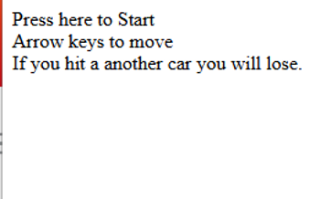

:::

::: {.column width="40%"}
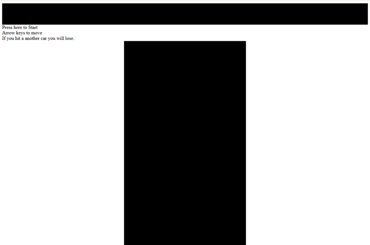
:::

::: {.column width="40%"}
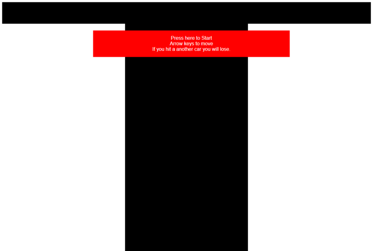
:::

:::::

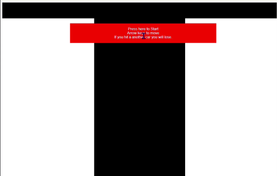{.center}

---

## Start the Project

1. Create a folder on your desktop. Name it with your name.

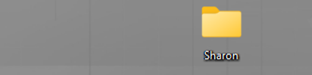

2. Open your section folder. Copy the file named `index` into your named folder.
3. Within your named folder -
    a) Right click index – Open in Sublime Text

    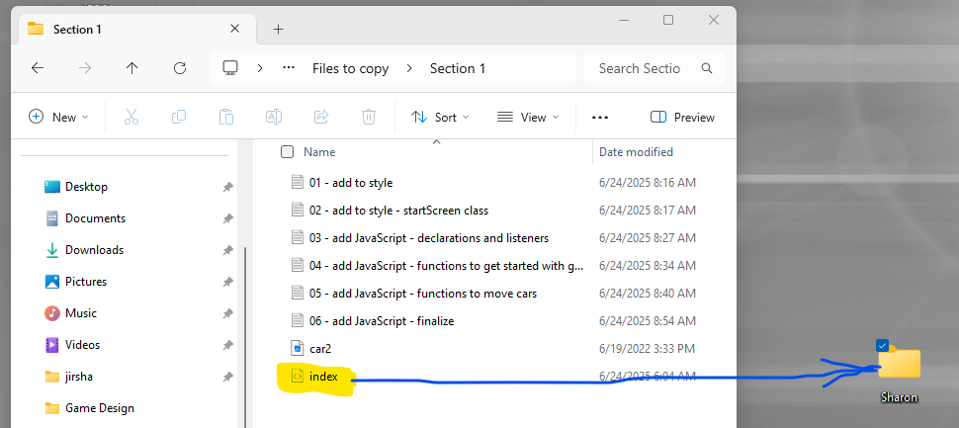

        or

    b) Open with – Choose another app – Sublime Text

**(Suggestion:  move Sublime & browser to external monitor and keep opened section folder on laptop screen)**

---

## Index.html

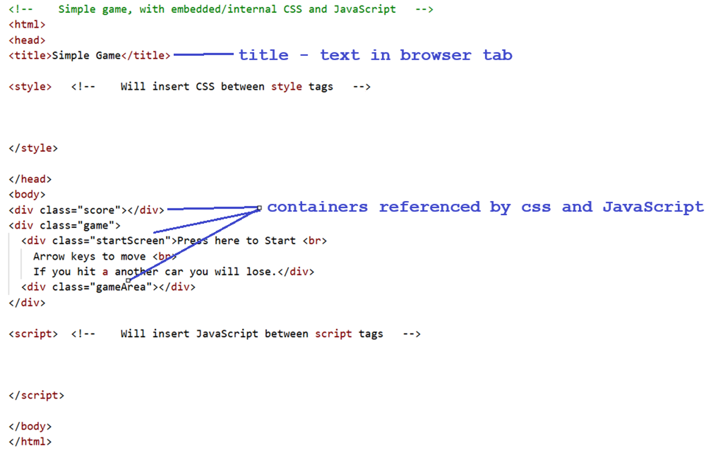

---

## Remove the indicated comments from the file:

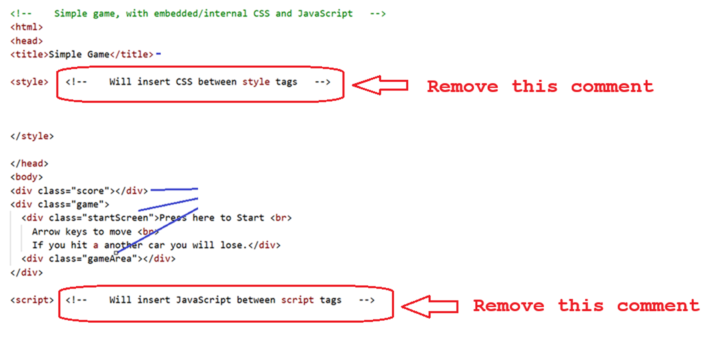

---

1. From section folder, open `01 – add to style`, and copy contents

2. In  `index`     paste right after the `<style>` tag
(  so that it is between    `<style>` and `</style>`  )

3. Save  -  and then Open in Browser

4. Among others, 2 containers that were referenced in HTML are styled:

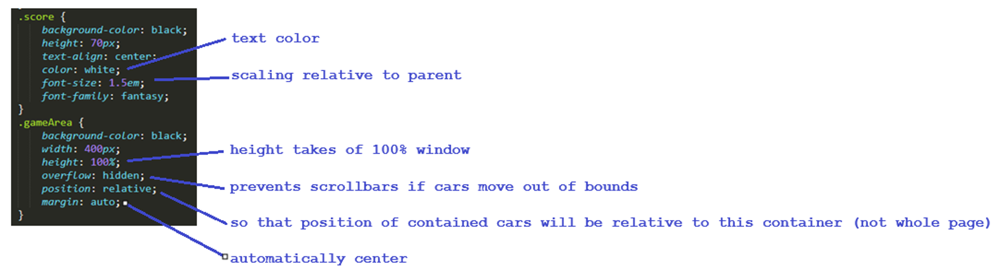

---

1. From section folder, open `02 – add to style – startScreen class`, and copy contents

2. In  `index`     paste right after the previous css code, but before `</style>`

3. Save  -  and then Open in Browser

4. Start screen that was referenced in HTML is styled:

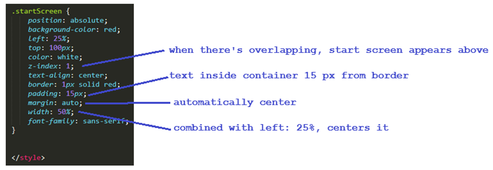

---

1. From section folder, open `03 – add JavaScript – declarations and listeners`, and copy contents

2. In  `index`     paste right after the `<script>` tag
(  so that it is between    `<script>` and `</script>`  )

3. Save  -  don’t have to open in browser – nothing visible or actionable changed

4. Declarations, initializations, set up listener:
        ( we haven’t started the game yet  )

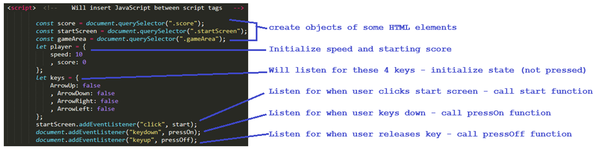


---

1. From section folder, open `04 – add to JavaScript – functions` to get started with game, and copy contents

2. In  `index`     paste right after the previous JavaScript code, but before `</script>`

3. Save  -  and then Open in Browser   -   click the start screen

4. The start function is called, start screen hidden, road lines visible, player elements created:

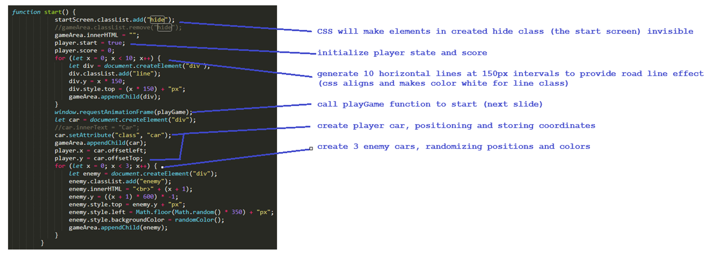

---

1. From section folder, open `05 – add to JavaScript – functions` to move cars, and copy contents

2. In  `index`     paste right after the previous JavaScript code, but before `</script>`

3. Save  -  and then Open in Browser   -   click the start screen

4. Player car moves and responds to keypresses:

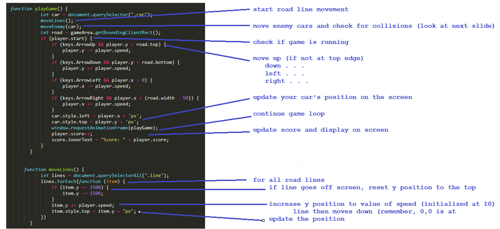

---

1. From section folder, open `05 – add to JavaScript – finalize`, and copy contents

2. In  `index`     paste right after the previous JavaScript code, but before `</script>`

3. Save  -  and then Open in Browser   -   click the start screen

4. The program is complete, and game plays as expected:

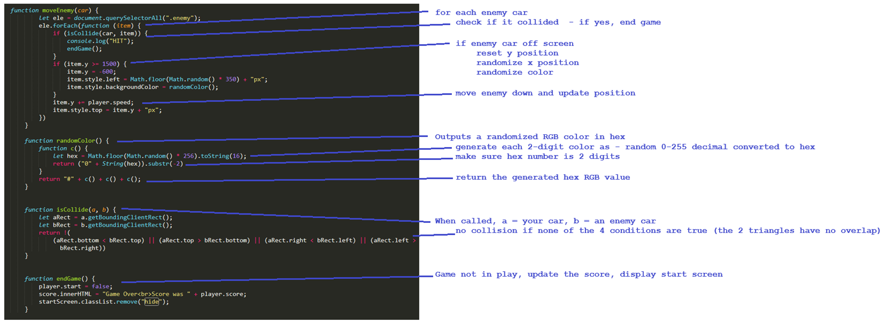


---

## Tweaks and adjustmets in style


```{.css .tall-code code-line-numbers="true" startFrom=12}
.car,
.enemy {
position: absolute;
bottom: 100px;
margin: auto;
width: 50px;
height: 100px;
background-color: white;    /* <1> */
line-height: 38px;
font-size: 1.7em;
text-align: center;
vertical-align: middle;
background-image: url(car2.png);
background-size: cover;
}
.line {
position: absolute;         /* <2> */
height: 100px;              /* <2> */
width: 10px;                /* <2> */
margin-left: 195px;         /* <2> */
background-color: white;    /* <2> */
}
.score {
background-color: black;    /* <3> */
height: 70px;               /* <3> */
text-align: center;         /* <3> */
color: white;               /* <3> */
font-size: 1.5em;           /* <3> */
font-family: fantasy;       /* <3> */
}
.gameArea {
background-color: black;    /* <4> */
width: 400px;               /* <4> */
height: 100%;               /* <4> */
overflow: hidden;           /* <4> */
position: relative;         /* <4> */
margin: auto;               /* <4> */
}

.startScreen {
position: absolute;
background-color: red;      /* <5> */
left: 25%;
top: 100px;
color: white;               /* <6> */
z-index: 1;
text-align: center;
border: 1px solid red;
padding: 15px;
margin: auto;
width: 50%;
font-family: sans-serif;
}
```
1. Change color of your car (enemy cars will get random colors in javascript)
2. Change anything about the road lines
3. Changes colors or sizing of score board
4. Change the color of the road
5. Change background color of start screen
6. Change text color of start screen

---

## Change initial speed or score start?

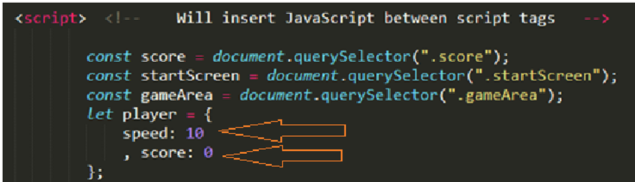