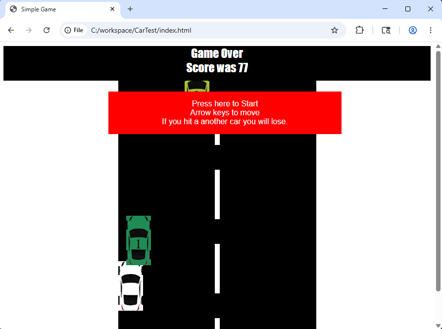

# Recap

## Our Project So Far

Now we have a fully working game.

{height="100%"}

. . .

<br><br>

### What's your high score so far (no modifications)?

---

## What's Happening Under the Hood {.smaller}


An **HTML document**, containing embedded **JavaScript code** and **CSS styling** is rendered by a **web browser** to provide an interactive experience.

::::: {.fragment}

#### HTML - **H**yper-**T**ext **M**arkup **L**anguage

Provides the **structure** of the page and most of the **content**.

::: {.callout-note .fragment}

Not actually a programming language!

:::

:::::

::::: {.fragment}

#### CSS - **Cascading Style Sheet**

Provides rules to tell the browser how targets should be displayed.

::: {.callout-note .fragment}

Not always in its own sheet!

:::

:::::

::::: {.fragment}

#### JavaScript

Scripting/Coding language executed in the brower, can affect and alter the page's DOM (Document Object Model).

::: {.callout-note .fragment}

Not really related to Java!

:::

:::::

# What Now?

## Make it Your Own

All of the code that you pasted in to the `HTML` file - you can modify that!

You can change small things like the speed, starting score, or color values.

Or you can change the functionality, game-over conditions, controls - anything you want!

---

## Today - Two Paths

We are going to focus on two tracks today.


::: {.fragment}

### 1. Style

Update the game to look better/different/unique.

You can change the colors, change the images, add backgrounds, gradients, animations, etc.

:::


::: {.fragment}

### 2. Functionality (Features)

Change the functionality of the game to add some kind of new feature.

You could change the number of enemies, change how many times you need to crash before losing, or change the system for scoring.

Or, just see how high you can get the score!

:::

# Style Examples

## Change Existing Colors

::: {.callout-important}

difficulty: Super Easy

:::


```{.css code-line-numbers="|2,5"}
.score {
    background-color: green;
    height: 70px;
    text-align: center;
    color: red;
    font-size: 1.5em;
    font-family: fantasy;
}
```

---

## Change the Car Image {.smaller}

Find or make another picture to use for the cars!

### Option 1: Find an Existing Image


::: {.callout-important}

difficulty: Easy

:::


Search for an image in a similar orientation to our example.

Try to narrow down your search with relevant keywords, like "top-down" and "transparent".

Save an image as a file in your project folder with a new name - maybe `car3.png` to start.

#### Now Make it Work!

What do you have to change in the `.html` file to get the image to appear?

What do you need to do in the actual game to get the new image to update?

What do you need to change about the image file for it to work better?

What can you change in the style section of the `.html` file to adjust the look?

---

## Change the Car Image

Find or make another picture to use for the cars!


### Option 2: Make Your Own Car!


::: {.callout-important}

difficulty: Medium

:::

Open up `Paint` and make a new file with similar dimensions (`77x154`) and draw up a new car look.

### Add Transparency

Save your car image as a `.png` file.

Now, select and delete or erase the background.

Remember, the cars have random colors by default, which will show through anywhere there is no background.

Follow the steps from the last section to add your image to the game!

---

## Add Some Backgrounds


::: {.callout-important}

difficulty: difficult

:::


Find or make a background image for part of the game.

Consider:

- The road
- The area outside of the road (grass? desert? city?)
- Road lines
- High Score display
- Start Button display

Save the images into the project folder, and then you will need to figure out how to get them into the game using our CSS code.

### Hint

```css
background-image: url(grass.png);
```

---

## Make Those Backgrounds Scroll


::: {.callout-important}

difficulty: Expert!!!

:::

Static backgrounds improve the look a lot, but for a racing game, it would be a lot better if they would scroll.

This will require some serious CSS trickery!

Consider checking out some CSS tricks:

[https://css-tricks.com/books/fundamental-css-tactics/infinite-scrolling-background-image/](https://css-tricks.com/books/fundamental-css-tactics/infinite-scrolling-background-image/)

Note: You will have to modify the instructions on that page quite a bit to make it work!

---

## Scrolling Background Spoiler (1/2)

```{.css .med-code code-line-numbers="" code-fold="true" }
body{                                           /* <1> */
    background: url(grass.png) repeat-y;        /* <1> */
    animation: slide 6.5s linear infinite;      /* <1> */
}                                               /* <1> */

.gameArea {                                     /* <2> */
    /* background-color: black; */
    width: 400px;
    height: 100%;
    overflow: hidden;
    position: relative;
    margin: auto;
    background: url("road.png") repeat-y;       /* <2> */
    animation: slide 1.5s linear infinite;      /* <2> */
}

.pause{                                         /* <3> */
    animation-play-state: paused;               /* <3> */
}                                               /* <3> */

@keyframes slide {                              /* <4> */
    0% {                                        /* <4> */
        background-position: 0 0;               /* <4> */
    }                                           /* <4> */
    100% {                                      /* <4> */
        background-position: 0 1024px;          /* <4> */
    }                                           /* <4> */
}                                               /* <4> */
```
1. Add background and animation to body
2. Add background and animation to game area
3. Add pause class (to pause animations)
4. Add animation definition


---

## Scrolling Background (2/2)

Don't forget to add the scripting!

```{.html}
<div class="gameArea pause">
```


```{.js code-line-numbers="|4-5"}
function start() {
    startScreen.classList.add("hide");
    gameArea.innerHTML = "";
    body.classList.remove("pause")
    gameArea.classList.remove("pause")
    player.start = true;
    player.score = 0;
}
```

```{.js code-line-numbers="|5-6"}
function endGame() {
    player.start = false;
    score.innerHTML = "Game Over<br>Score was " + player.score;
    startScreen.classList.remove("hide");
    body.classList.add("pause")
    gameArea.classList.add("pause")
}
```

# Functionality Examples

## Change the Numbers


::: {.callout-important}

difficulty: Easy

:::

Update the starting score, speed, or scoring increment.

Speed and starting score:
```{.js code-line-numbers="|2-3"}
let player = {
    speed: 10,
    score: 0,
};
```

Update scoring increment:
```{.js .med-code code-line-numbers=""}
function mainGameLoop() {
  moveLines();
  moveEnemies();
  movePowerup()
  respondToMovementKeys();
  // If the game is still active, run the game loop again
  if (playerStatus.gameActive) {
    window.requestAnimationFrame(mainGameLoop);
  }
}
```

```{.js code-line-numbers="14"}
function moveEnemies() {
  let car = document.querySelector(".playerCar");
  let ele = document.querySelectorAll(".enemy");
  ele.forEach(function (item) {
    if (checkCollision(car, item)) {
      console.log("HIT");
      endGame();
    }
    if (item.y >= 1500) {
      item.y = -600;
      item.style.left = Math.floor(Math.random() * 350) + "px";
      item.style.backgroundColor = getRandomColor();
    }
    item.y += 1;
    item.style.top = item.y + "px";
  });
}
```

---

## Add Powerups


::: {.callout-important}

difficulty: Extreme!!!!!

:::

Powerup Styling:

```{.css .tall-code}
.powerup {
    position: absolute;
    bottom: 100px;
    margin: auto;
    width: 64px;
    height: 64px;
    background-color: white;
    line-height: 38px;
    font-size: 1.7em;
    text-align: center;
    vertical-align: middle;
    background-image: url(powerup.png);
    background-size: cover;
}
```

---

## Add Powerups

Spawn new powerups!

In the `startNewGame()` function:

```{.js}
  const numberOfPowerups = 2;
  for (let x = 0; x < numberOfPowerups; x++) {
      let powerup = document.createElement("div");
      powerup.classList.add("powerup");
      // powerup.innerHTML = "<br>" + (x + 1);
      powerup.y = (x + 1) * 600 * -1;
      powerup.style.top = powerup.y + "px";
      powerup.style.left = Math.floor(Math.random() * 350) + "px";
      // powerup.style.backgroundColor = randomColor();
      roadArea.appendChild(powerup);
  }
```

## Add Powerups {.smaller}

Below `moveEnemy()`:

```{.js code-line-numbers="" .tall-code}
function movePowerup() {
    let listOfPowerups = document.querySelectorAll(".powerup");
    listOfPowerups.forEach(function (item) {
        if (checkCollision(playerCar, item)) {
            console.log("POWERUP");
            item.classList.add("hide")
            gainPowerup();
        }
        if (item.y >= 1500) {
            item.y = -1000;
            item.style.left = Math.floor(Math.random() * 350) + "px";
            item.style.backgroundColor = getRandomColor();
        }
        item.y += (playerStatus.speed/2);
        item.style.top = item.y + "px";
    });
}
```

In the `mainGameLoop()` function:

```{.js code-line-numbers="|5"}
function mainGameLoop() {
    moveLines();
    moveEnemies();
    respondToMovementKeys();
    movePowerup(car)
```

---


## Add Powerups

The Powerup Scripts:

```{.js .tall-code}
function gainPowerup(){
    let powerOptions = [speedUp, slowDown]
    let gotPower = Math.floor(Math.random() * powerOptions.length)
    console.log("Got this powerup: " + powerOptions[gotPower].name)
    setTimeout(powerOptions[gotPower].activate, 0);
}

let speedUp = {
    "name" : "Speed Up",
    "activate": () => {
        console.log("SPEEEEEEED")
    }
}
let slowDown = {
    "name" : "Slow Down",
    "activate": () => {
        console.log("slooooooooooow")
    }
}
```


---


## Add Powerups

Now, make those powerups do something!

```{.js .tall-code code-line-numbers="|5,12"}
let speedUp = {
    "name" : "Speed Up",
    "activate": () => {
        console.log("SPEEEEEEED")
        playerStatus.speed += 3
    }
}
let slowDown = {
    "name" : "Slow Down",
    "activate": () => {
        console.log("slooooooooooow")
        playerStatus.speed -= 3
    }
}
```

## Add Powerups

::: {.r-fit-text}
The ultimate challenge:

Can you make your own powerup??
:::

---

## Showcase

Work on adding either **style** or **functionality** (or both!).

When you've got something to show, raise your hand and let us know!