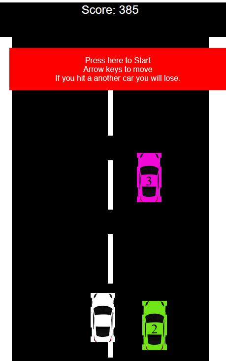

# Car Game

This repo presents an interactive car game website that you can help build!

The folder called `Start` has a basic HTML file called `index.html` that will serve as the base of the website. You can follow along with the slides to paste together the extra code to turn the site into a full working game, running in your web browser!

The folder called `Finish` has a completed version of the game.

You can download the repo and modify the files to make the game your own!

## The Slides

[Day 1 Slides](https://jluppes.github.io/CarGame/Slides/docs/CarGameSlides/CarGame.html)

[Day 2 Slides](https://jluppes.github.io/CarGame/Slides/docs/CarGameSlides/CarGameDay2.html)

## The Game

You can play the [finished game here!](https://jluppes.github.io/CarGame/Finish/index.html)

